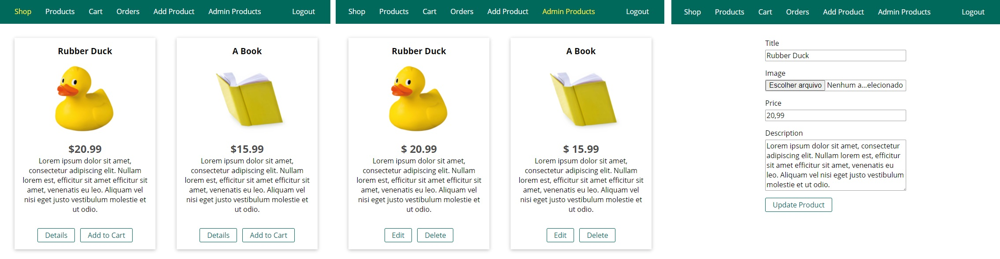
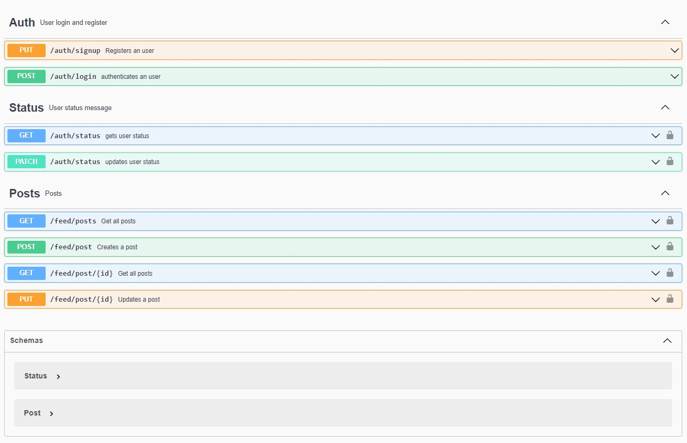

# NodeJS - The Complete Guide

This repo is going to contain the finished code for Maximilian's [NodeJS - The Complete Guide](https://www.udemy.com/course/nodejs-the-complete-guide/). 

## CRUD/Store 

Image

Is the main line project done in this course, it consists of a store/marketplace where users can post products with images so that other users can buy. By the end of the course this app was re-done a couple of times, so that instead of having lots of small projects we get a holistic view why X is done instead of Y.

The stack used in the live version is the following:

  - MongoDB with Mongoose ODM/ORM
  - Express with EJS templating language
  - Multer for images upload
  - Stripe was used for payment
  - helmet and csurf to protect packets
  - Nodemailer with SendGrid for emails
  - bcrypt for password hashing
  - pdfkit to transform the invoice using _pipe_

## Messages API

Image

Is a reddit-like API that has user authentication and it allows it for users to have an status, make a post and like other users posts it also uses WebSockets to update in real time.
